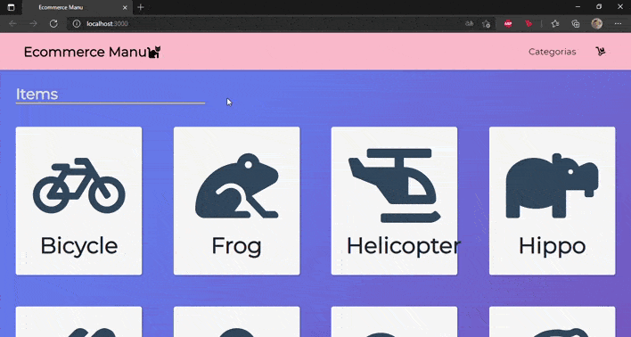

Proyecto react
La consigna era Desarrollar un e-commerce utilizando React y una base de datos Firebase para poder vender productos de un rubro a elección.

* Un usuario debe poder ingresar, navegar por los productos e ir a sus detalles.
* Desde el detalle se debe poder ver la descripción, foto y precio e ingresarlo al carrito.
* Una vez que el carrito tenga al menos un producto, se deberá visualizar un listado compacto de la orden con el precio total.
* Al ingresar su nombre, apellido, teléfono e e-mail (ingresándolo dos veces para corroborar que sea correcto), debe activarse el botón de ‘realizar compra’.
* Al clickear ‘realizar compra’ debe guardarse en la base de datos una orden que tenga todos los productos, la fecha y dar feedback del número de orden.

Instrucciones
$ cd desktop
$ git clone 
$ npm i

Utilizado
[React](https://reactjs.org/)
[Bootstrap ](https://getbootstrap.com/)
[Firebase ](https://firebase.google.com/)
[FontAwesome](https://fontawesome.com/v5.15/icons)

